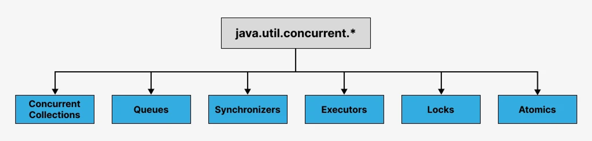

# Билет №16:

## 1. Интерфейс Set. Основные реализации. Как работают вставка, удаление, поиск элемента на примере одной из реализаций.

Set: коллекция элементов, не допускающих дублирования.

Интерфейс Set представляет неупорядоченную коллекцию элементов, в которой каждый элемент является уникальным,
 то есть не имеет дубликатов. Уникальность элементов проверяется с помощью метода equals(). Интерфейс Set расширяет Collection.

Основные методы, предоставляемые интерфейсом Set:

- add(Object o) – Добавляет указанный элемент в это множество, если он еще не присутствует.
Если это множество уже содержит указанный элемент, вызов оставляет множество неизменным и возвращает 'false'.
- addAll(Collection c) – Добавление элементов коллекции, если они отсутствуют.
- clear() – Удаляет все элементы из этого множества. Множество будет пустым после вызова этого метода.
- contains(Object o) - Проверка присутствия элемента в наборе. Возвращает 'true', если элемент найден.
- containsAll(Collection c) – Проверка присутсвия коллекции в наборе. Возвращает 'true', если все элементы содержатся в наборе.
- isEmpty() – Возвращает 'true', если это множество не содержит элементов.
- remove(Object o) – Удаляет указанный элемент из этого множества, если он присутствует.
- size() – Возвращает количество элементов в этом множестве.

В отличие от интерфейса List, Set не предоставляет методы для доступа к элементам по индексу, поскольку наборы не упорядочены.

## 2.Библиотека java.util.concurrent.*. Коллекции для работы с многопоточностью.

Имеет такую схему:

Concurrent Collections
Обычные наборы данных, реализующих интерфейсы List, Set и Map, нельзя использовать в многопоточных приложениях, 
если требуется синхронизация, т.е. такие коллекции недопустимы для одновременного чтения и изменения данных разными потоками. 

Пакет java.util.concurrent предлагает свой набор потокобезопасных классов, допускающих разными потоками одновременное чтение и внесение изменений.
Все операции по изменению коллекции (add, set, remove) приводят к созданию новой копии внутреннего массива. Этим гарантируется, что при проходе итератором по коллекции не будет ConcurrentModificationException. 

Queues
1)Неблокирующие и блокирующие очереди для работы в многопоточной среде. Неблокирующие очереди сосредоточены на скорости и работе без блокирования потоков
2)Блокирующие очереди подходят для работы, когда нужно “притормозить” потоки Producer или Consumer. Например, в той ситуации, когда не выполнены какие-то из условий, очередь пуста или переполнена, или же нет свободного Consumer'a.

Synchronizers
Вспомогательные утилиты для синхронизации потоков(Semaphore, CountDownLatch etc).

Executors 

Locks
Много гибких механизмов синхронизации потоков по сравнению с базовыми synchronized,wait,notify,notifyAll. Например, Lock, ReadWriteLock.

Atomics
Классы, которые могут поддерживать атомарные операции над примитивами и ссылками.

Пакет java.util.concurrent.atomic включает девять атомарных классов для выполнения, так называемых, атомарных операций. Операция является атомарной, 
если её можно безопасно выполнять при параллельных вычислениях в нескольких потоках, не используя при этом ни блокировок, ни синхронизацию synchronized.

Атомарный класс включает метод compareAndSet, реализующий механизм оптимистичной блокировки и позволяющий изменить значение только в том случае,
если оно равно ожидаемому значению.

3.(Задача)Реализуйте программу на Java, которая создаёт три потока, которые общаются через одну потокобезопасную коллекцию.
В качестве данных используется класс, который содержит обязательное поле типа String, остальные поля на усмотрение разработчика.
Первый поток читает данные из указанного файла по строчно в класс (одна строка - один класс),
выполняет reverse строки в классе и пишет обратно в коллекцию. Второй поток читает данные,
выполняет перевод в верхний регистр только для данных от первого потока и отправляет обратно в коллекцию.
Третий поток читает данные, выполняет запись строки в отдельный файл только для данных от второго потока.

